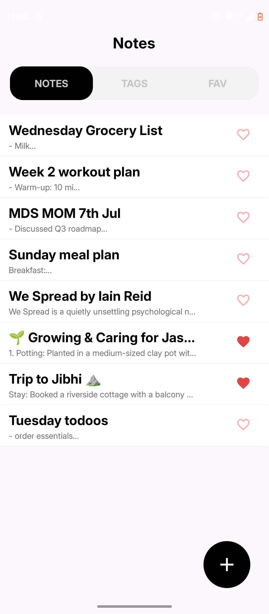
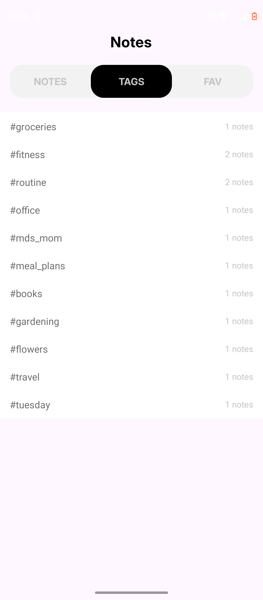
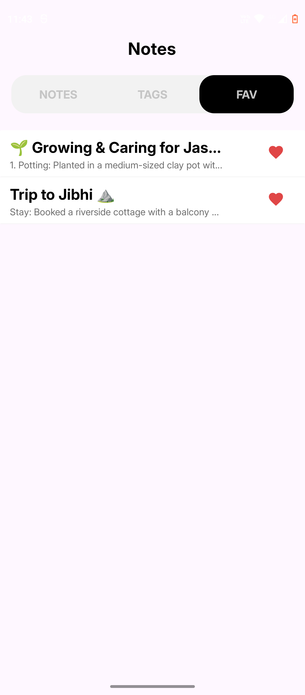
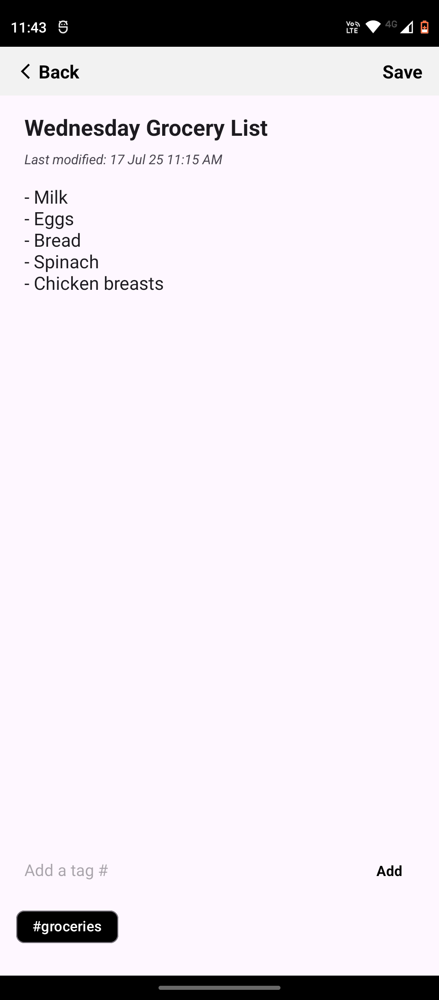
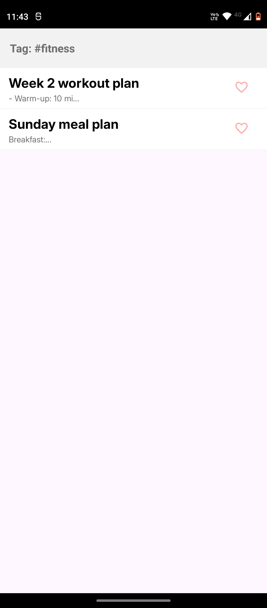

# 📝 Notes App

<p align="center">
  
</p>

A clean and modern Android Notes App built using Kotlin. This app lets users create, edit, delete, and organize their notes using **tags** and **favorites**. It also features **tab navigation**, **room database integration**, and a beautiful **UI** built with XML (no Jetpack Compose).

---

## 📱 App Demo

<p align="center">
  
</p>


---

## ✨ Features

- ✅ Create, edit, and delete notes
- 🏷️ Add tags to your notes (displayed as chips)
- ⭐ Mark/unmark notes as favorites
- 🕒 Shows "Last Modified" timestamp
- 🗂️ Filter and view notes by tags
- 🧭 Bottom tab navigation (Notes / Tags / Favs)
- 🎨 Light, minimal UI built using XML
- 🗃️ Data persistence with RoomDB

---

## 🖼️ Screenshots

### ➤ Notes Tab


### ➤ Tags Tab


### ➤ Favorites Tab


### ➤ Create/Edit Note


### ➤ Inside Tags Page


---

## ⚙️ Tech Stack

- **Language**: Kotlin  
- **Architecture**: MVVM  
- **UI**: XML (no Jetpack Compose)  
- **Database**: RoomDB  
- **Navigation**: Fragment + ViewPager2  
- **Other**: LiveData, RecyclerView, Material Design 3

---

## 🚀 Getting Started

1. Clone the repo:
   ```bash
   git clone https://github.com/yourusername/notes-app.git
